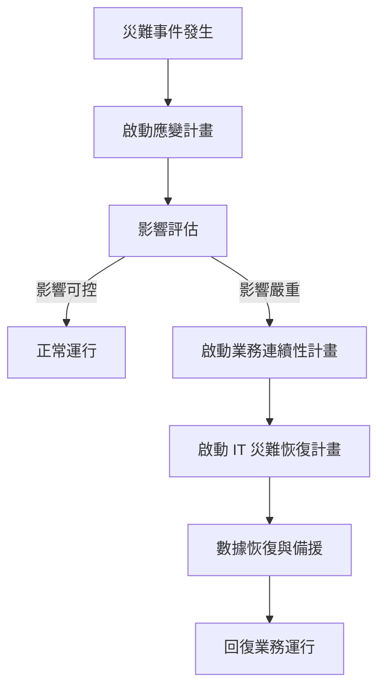
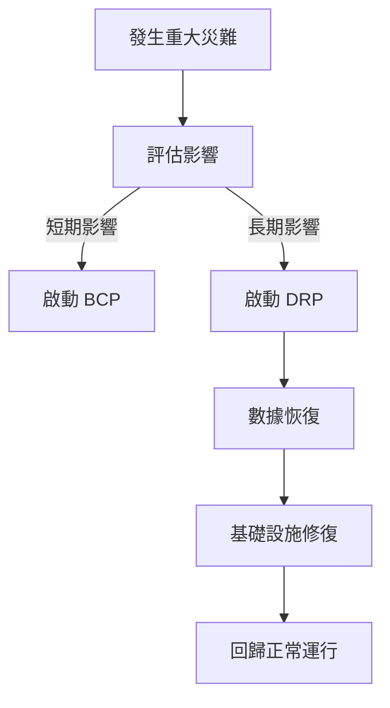
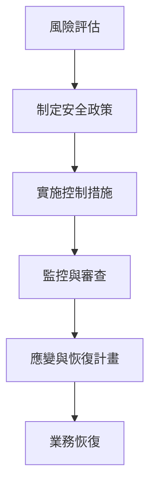

# 📌 業務連續性與災難恢復指南（BCP & DRP）

🛡 **官方標準與指南（免費 & 可信）**  
這些標準由 **NIST（美國國家標準與技術研究院）** 和 **ISO（國際標準組織）** 發布，業界公認，涵蓋災難恢復 (DR)、業務連續性計劃 (BCP)、數據銷毀、物理安全等主題。

## 1️⃣ 災難恢復 (DR) & 業務連續性計劃 (BCP)

| 標準             | 描述                                      | 連結          |
|------------------|-------------------------------------------|---------------|
| NIST SP 800-34 Rev.1 | IT 系統災難恢復計劃 (DRP)、業務連續性計劃 (BCP) 和緊急回應策略指南 | [點擊查看](https://csrc.nist.gov/publications/detail/sp/800-34/rev-1/final) |
| ISO 22301        | 業務連續性管理系統（BCMS）：如何建立、實施、維護和改進 | [點擊查看](https://www.iso.org/standard/75106.html) |

## 2️⃣ 安全政策制定

| 標準             | 描述                                      | 連結          |
|------------------|-------------------------------------------|---------------|
| NIST SP 800-12   | 資訊安全指南，包括密碼策略、存取控制、安全意識培訓等 | [點擊查看](https://csrc.nist.gov/publications/detail/sp/800-12/rev-1/final) |
| NIST SP 800-53 Rev. 5 | 資訊安全控制框架，提供完整的安全控制標準 | [點擊查看](https://csrc.nist.gov/publications/detail/sp/800-53/rev-5/final) |

## 3️⃣ 數據備份與恢復方法

| 標準             | 描述                                      | 連結          |
|------------------|-------------------------------------------|---------------|
| NIST SP 800-209  | 數據備份與恢復最佳實踐，包含增量備份、差異備份、完整備份等 | [點擊查看](https://csrc.nist.gov/publications/detail/sp/800-209/final) |

## 4️⃣ 人員安全（職責分離、背景調查、社會工程防禦）

| 標準             | 描述                                      | 連結          |
|------------------|-------------------------------------------|---------------|
| NIST SP 800-100  | 企業資訊安全治理指南，涵蓋訪問控制、員工安全培訓、職責分離 (SoD) | [點擊查看](https://csrc.nist.gov/publications/detail/sp/800-100/final) |

## 5️⃣ 數據銷毀與介質清理

| 標準             | 描述                                      | 連結          |
|------------------|-------------------------------------------|---------------|
| NIST SP 800-88 Rev.1 | 媒體清理與數據銷毀標準，包含消磁 (Degaussing)、物理銷毀 (Shredding)、安全擦除 (Secure Erase) | [點擊查看](https://csrc.nist.gov/publications/detail/sp/800-88/rev-1/final) |

## 6️⃣ 物理安全控制

| 標準             | 描述                                      | 連結          |
|------------------|-------------------------------------------|---------------|
| ISO/IEC 27002:2022 | 物理與環境安全指南，包含機房安全、訪問控制、滅火器放置、安全監控等 | [點擊查看](https://www.iso.org/standard/75652.html) |

---

## 📊 業務連續性計劃 (BCP) 架構

以下為業務連續性計劃 (BCP) 的主要結構與緊急回應流程圖：

# 🔥 危機溝通計畫

## 企業應準備危機溝通計畫，以應對中斷事件時的內外部溝通：
|溝通類型	|描述|
|內部通報	|確保員工能獲得即時資訊|
|對外通告	|由授權人員發佈正式聲明|
|社群媒體應對	|控制謠言與公關危機|

# 🔄 災難恢復計畫 (DRP)

###DRP 適用於長時間中斷或基礎設施無法使用的情況。企業應確保：

-    備援機房可用（Cold Site, Warm Site, Hot Site）
-    測試恢復程序，確保數據完整性
-    異地備份機制，防範單點故障

# 1️⃣ 災難恢復 - 溫/冷/熱站點
## 🔹 關鍵概念

災難恢復 (DR) 站點分為 冷站點 (Cold Site)、溫站點 (Warm Site)、熱站點 (Hot Site)，目標是確保業務在災難後迅速恢復。
類型	設備狀態	數據同步	啟動時間	成本
- 冷站點 (Cold Site)	只有基礎設施	無數據	數天到數週	低
- 溫站點 (Warm Site)	部分設備與舊數據	定期同步	數小時到數天	中等
- 熱站點 (Hot Site)	完整鏡像與即時同步	實時同步	幾分鐘到數小時	高

# NIST 參考標準：NIST SP 800-34
## 2️⃣ 9/11 後影響 DRP/BCP 的行業變化
🔹 關鍵影響

 -   企業更加重視 BCP 與 DRP。
  -  監管機構加強合規要求（如 SOX、ISO 22301）。
   - 遠程備份與異地站點成為標準。

項目	9/11 前	9/11 後
BCP/DRP 優先級	可選	必須
異地備援站點	少數企業使用	幾乎所有大企業使用
合規標準	較為寬鬆	強制要求

ISO 參考標準：ISO 22301
3️⃣ 初步安全規劃步驟（SSCP 重點補充）
🔹 關鍵步驟

    風險評估 (Risk Assessment)：識別系統風險與漏洞（SSCP 重點：定量與定性分析）。
    制定安全政策 (Security Policy)：確定訪問控制、密碼策略等。
    實施控制措施 (Implement Controls)：加強身分驗證、網路安全（SSCP 重點：選擇適當控制）。
    監控與審查 (Monitor & Audit)：定期審查政策與流程。
    應變與恢復計畫 (Incident Response & Recovery)：確保業務可恢復（SSCP 重點：事件分類與回應流程）。

NIST 參考標準：NIST SP 800-12, NIST SP 800-53
# 4️⃣ 備份策略（增量、差異等）
備份類型	描述	優點	缺點
- 完整備份 (Full)	每次備份所有數據	恢復最快	佔用空間大
- 增量備份 (Incremental)	只備份上次備份後變更數據	備份速度快	需多次還原
- 差異備份 (Differential)	備份自上次完整備份後變更數據	恢復比增量快	備份比增量大

NIST 參考標準：NIST SP 800-209
# 5️⃣ 職責分離 (SoD) 與工作輪換安全控制
🔹 關鍵概念

    職責分離 (SoD)：防止濫權與欺詐。
    工作輪換 (Job Rotation)：降低內部威脅風險。

角色	負責事項	不可兼任職務
系統管理員	維護伺服器	資料庫管理
財務主管	簽署財務報表	核准付款
開發人員	編寫應用程式	部署程式

NIST 參考標準：NIST SP 800-100
6️⃣ CD-ROM 安全處置（消磁與銷毀）
🔹 關鍵技術

    消磁 (Degaussing)：用磁場破壞數據。
    物理銷毀 (Shredding)：粉碎介質。
    覆寫 (Overwrite)：多次寫入隨機數據。

方法	適用媒體	是否可復原
消磁	硬碟、磁帶	否
粉碎	CD-ROM、HDD	否
覆寫	HDD、SSD	可能復原

NIST 參考標準：NIST SP 800-88 Rev.1
7️⃣ 電氣設備的滅火器放置
滅火器類型	適用範圍	優點	缺點
CO₂ 滅火器	電子設備	無殘留	對人不安全
乾粉滅火器	電氣設備	廣泛適用	產生粉塵
氣溶膠滅火系統	數據中心	高效滅火	成本高

ISO 參考標準：ISO/IEC 27002:2022
SSCP 考試方向補充建議

    風險管理：熟悉風險評估的定量與定性方法，並能應用到 BCP/DRP。
    事件回應：了解事件分類（低、中、高嚴重性）與回應流程。
    控制措施：能根據 NIST SP 800-53 選擇適當的安全控制。
    實務應用：熟悉備份策略與站點選擇的實際場景（如成本與恢復時間權衡）。
