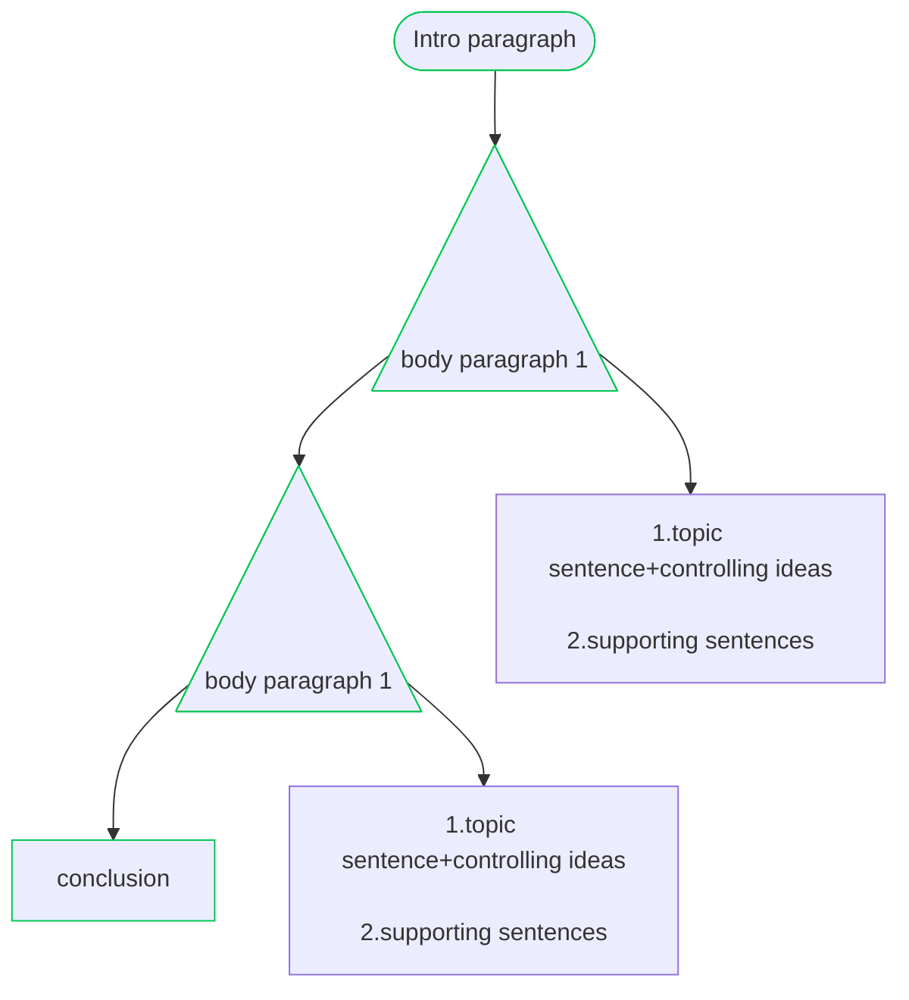
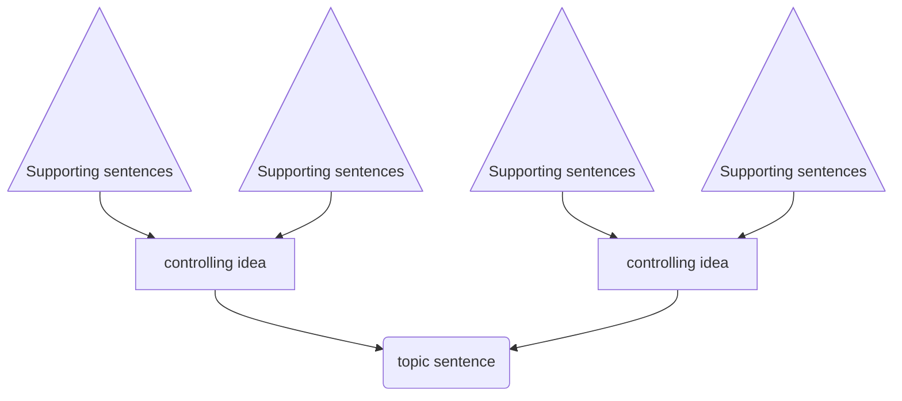

IELTS 寫作筆記 (Task 2) 核心概念分析

# 1. Paragraph Structure (段落結構)

## -Whole task 2 structure 

## - Body paragraph structure only pointer(inderict proof)

標準組成:

- Topic sentence (主題句) 

- Supporting sentences (支持句) 

- (Optional)  Concluding sentence (結論句) -> repharse intro paragraph

### 1.1 Topic Sentence (主題句)

### - 公式: Topic (主題) + controlling idea (限制主題範圍) 

範例:

- Topic: "Living in Taipei" 

- Controlling Idea: "has many advantages" 

### 1.2 Supporting sentences

### 1.3 Concluding sentence (結論句)
---

# 2. Unity (統一性) / Coherence (連貫性) 核心重點:

- Unity (統一性) 

- Coherence (連貫性) 

# 2. Argument Development (論點發展 / 驗證方法)

#### Verification methods (驗證方法): 

- 2.1 Facts (事實) 

- - 2.1.1 Explanations, descriptions (解釋與描述) 

- - 2.1.2 To be more specific 

- -  - - That is to say that 

- 2.2 Examples

- 2.3 Number & authority (數據與權威) 

範例: according to the latest survey... 

- 2.4 Quotation & authority (引用與權威) 

---

# 3. Cohesion and Logic (銜接與邏輯)

- 3.1 Logical order (邏輯順序): 

- 3.2 Time order (時間順序): 

範例: First of all 

- 3.3 Importance order (重要性順序):

範例: The first and most important 

- 3.4 Other Cohesive Devices (其他銜接手段跟注意事項):

- 3.4.5 Repeat the keywords (重複關鍵字) (no need for change) 

- 3.4.6 Pronouns (代名詞一致) 

- 3.4.7 Transition words (轉折詞) 

---

# 4. Academic Style (學術風格)
注意事項:

- 4.1 關鍵規則: NO "I", "You", "we" 

- 4.2 Verb tense (動詞時態) 

- 4.3 Article Usage (冠詞使用)

範例: a pen / the pen / pens / pen

```mermaid
graph TD
    A["IELTS 寫作筆記 (Task 2)"] --> B("核心概念分析")

    B --> C["Paragraph Structure (段落結構)"]
    C --> C1("Unity (統一性)")
    C --> C2("Coherence (連貫性)")
    C --> C3("Topic sentence (主題句)")
    C --> C4("Supporting sentences (支持句)")
    C --> C5("Concluding sentence (結論句) (Optional)")

    B --> D["Topic Sentence (主題句)"]
    D --> D1("公式: Topic + controlling idea")
    %% --- 修正後的行 ---
    D --> D2("範例: &quot;Living in Taipei&quot; + &quot;has many advantages&quot;")

    B --> E["Argument Development (論點發展)"]
    subgraph "Verification methods (驗證方法)"
        E1("Facts (事實)")
        E2("Explanations, descriptions (解釋與描述)")
        E3("Example (舉例)")
        E4("Number & authority (數據與權威)")
        E5("Quotation & authority (引用與權威)")
    end
    E --> E1
    E --> E2
    E2 --> E2a("To be more specific")
    E2 --> E2b("That is to say that")
    E --> E3
    E --> E4
    %% --- 修正後的行 ---
    E4 --> E4a("e.g., &quot;according to the latest survey...&quot;")
    E --> E5

    B --> F["Cohesion and Logic (銜接與邏輯)"]
    F --> F_sub1("Logical order (邏輯順序)")
    subgraph "Logical Order Methods"
        F1a("Time order (時間順序)")
        F1b("Importance order (重要性順序)")
    end
    F_sub1 --> F1a
    %% --- 修正後的行 ---
    F1a --> F1a1("e.g., &quot;first of all&quot;")
    F_sub1 --> F1b
    %% --- 修正後的行 ---
    F1b --> F1b1("e.g., &quot;The first and most important&quot;")

    F --> F_sub2("Other Cohesive Devices (其他銜接手段)")
    subgraph "Other Devices"
        F2a("Repeat the keywords (重複關鍵字)")
        F2b("Pronouns (代名詞)")
        F2c("Transition words (轉折詞)")
    end
    F_sub2 --> F2a
    F_sub2 --> F2b
    F_sub2 --> F2c

    B --> G["Academic Style (學術風格)"]
    G --> G1("規則: NO 'I', 'You', 'we'")
    G --> G2("Verb tense (動詞時態)")
    G --> G3("Article Usage (冠詞使用)")
    %% --- 修正後的行 ---
    G3 --> G3a("e.g., &quot;a pen&quot; vs &quot;the pen&quot;")
    
```

