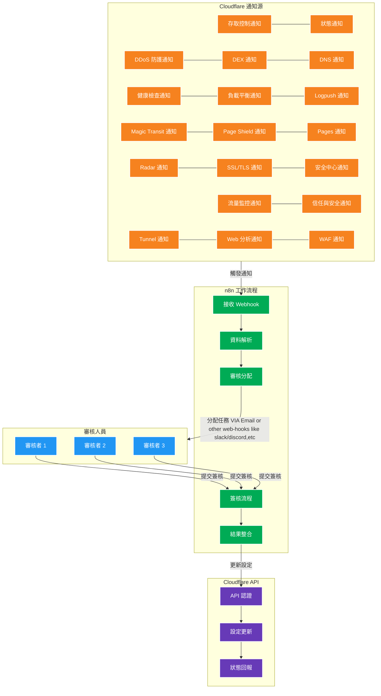

```mermaid
graph TD
    subgraph Cloudflare["Cloudflare 通知源"]
        %% 第一行
        A2[存取控制通知] ---   A4[狀態通知]
        %% 第二行
        A5[DDoS 防護通知] --- A6[DEX 通知] --- A7[DNS 通知]
        %% 第三行
        A8[健康檢查通知] --- A9[負載平衡通知] ---   A10[Logpush 通知] 
        %% 第四行
        A11[Magic Transit 通知] --- A12[Page Shield 通知] --- A13[Pages 通知]
        %% 第五行
        A14[Radar 通知] --- A15[SSL/TLS 通知] --- A16[安全中心通知] 
        %% 第六行
        A18[流量監控通知] --- A19[信任與安全通知]
        %% 第七行
        A20[Tunnel 通知] --- A21[Web 分析通知] --- A22[WAF 通知]
       
        
    end

    subgraph N8N["n8n 工作流程"]
        B1[接收 Webhook]
        B2[資料解析]
        B3[審核分配]
        B4[簽核流程]
        B5[結果整合]
    end

    subgraph Auditors["審核人員"]
        C1[審核者 1]
        C2[審核者 2]
        C3[審核者 3]
    end

    subgraph CloudflareAPI["Cloudflare API"]
        D1[API 認證]
        D2[設定更新]
        D3[狀態回報]
    end

    %% 流程連接
    Cloudflare --> |觸發通知| B1
    B1 --> B2
    B2 --> B3
    B3 --> |分配任務 VIA Email or other web-hooks like slack/discord,etc| Auditors
    C1 & C2 & C3 --> |提交簽核| B4
    B4 --> B5
    B5 --> |更新設定| D1
    D1 --> D2
    D2 --> D3

    %% 樣式
    classDef cloudflare fill:#F6821F,stroke:#fff,stroke-width:2px,color:#fff
    classDef n8n fill:#00AB55,stroke:#fff,stroke-width:2px,color:#fff
    classDef auditor fill:#2196F3,stroke:#fff,stroke-width:2px,color:#fff
    classDef api fill:#673AB7,stroke:#fff,stroke-width:2px,color:#fff

    class A1,A2,A3,A4,A5,A6,A7,A8,A9,A10,A11,A12,A13,A14,A15,A16,A17,A18,A19,A20,A21,A22 cloudflare
    class B1,B2,B3,B4,B5 n8n
    class C1,C2,C3 auditor
    class D1,D2,D3 api
```
